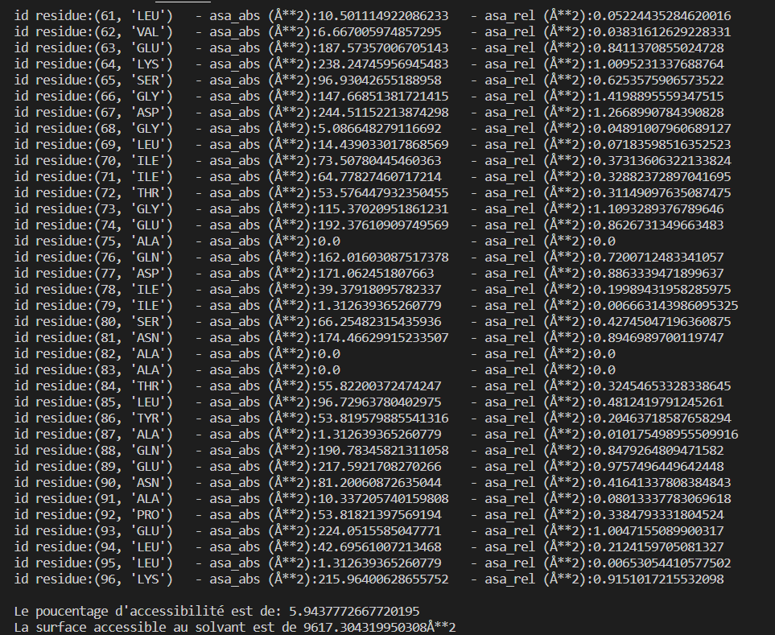

# Calculation of the solvent accessible surface of a protein
## How to install?
> gh repo clone abelaktib/nouveaurepo
## What is it for?
Our program will retrieve the atoms from a .pdb file of a protein of interest and create objects corresponding to each atom.
From these objects a sphere will be generated in the form of point coordinates using the fibonacci algorithm. Then for each of these atoms we will count the number of free points (exposed to the solvent).
The number of exposed points as well as the total surface allows us to obtain the surface exposed to the solvent.
Several results are obtained: the accessible surface, the relative accessible surface, the percentage of accessibility and the total accessible surface.

## Example (final display)
The results obtained are directly displayed on the terminal like this:

## Dependencies :
 Python et Biopython

## How to execute?
To launch the program in your terminal run this command:
> python .\bin\main.py

The program will then ask you to enter the location of your file. pdb

