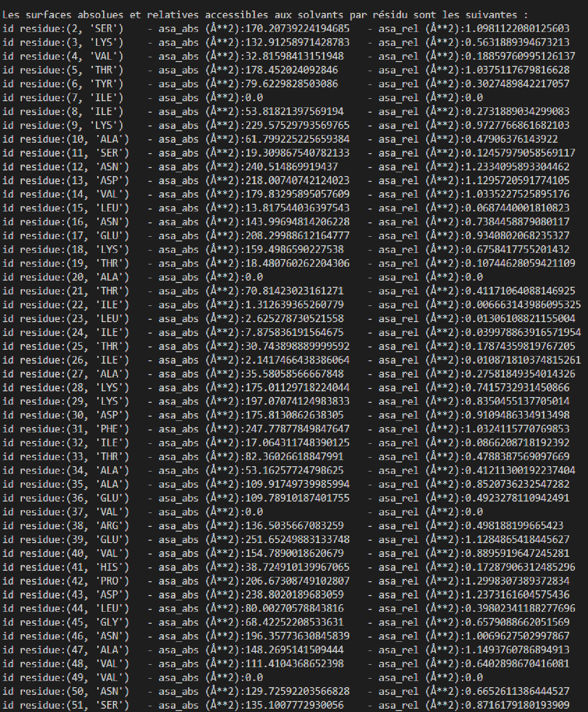
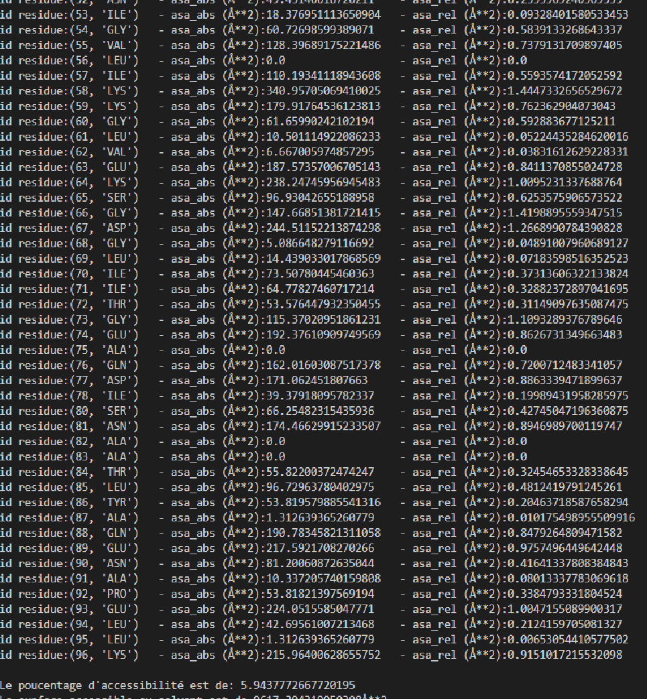

# Calcul de la surface accessible au solvant d’une protéine
## Installation
> gh repo clone abelaktib/project_surface
## A quoi ca sert ?
    Notre programme va récupérer les atomes d'un fichier .pdb d'une proténes d'intérêt et créer des objets correspondant à chaque atomes.
    De ces objets une sphère va être générer sous forme de coordonées point grâce à l'algorithme de fibonacci. Ensuite pour chacun de
    ces atomes nous allons compté le nombre de point libre (exposé au solvant).
    Le nombre de point exposés ainsi que la surface totale nous permet d'obtenir la surface exposé au solvant.
    Plusieurs résultats sont obtenues : La surface accessible, La surface accessible relative, le poucentage d'accessibilité ainsi
    que la surface accessible totale.

## Exemple (display final)
Les résultats obtenus sont directement affiché sur le terminale comme ceci:

## Dependencies :
 Python et Biopython

## Comment l'execute?
Pour lancer le programme dans votre terminale executez cette commande :
> python ./bin/main.py

Le programme vous demandera alors d'entrer  l'emplacement de votre fichier. pdb

